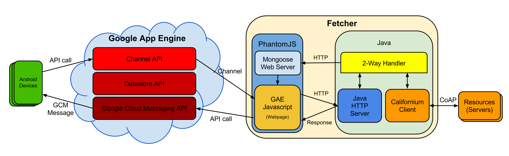

# IoTCloud - Google Cloud
IoT Cloud is an architecture that aims to bridge networks of CoAP constrained nodes (located in LANs) with Internet-connected clients (such as Android devices), in order to eliminate geographical restrictions without sacrificing performances.

The following scheme provides a complete view of the structure:

**DISCLAIMER**: This is the Google Cloud & Android App part of the project; you can find the repository about CoAP [here](https://github.com/MircoRosa/iotcloud-coap).

An in-depth description of the entire project can be found (in Italian) on my [Thesis](docs/Thesis.pdf), [Project Summary](docs/Riassunto.pdf) and [PDF Presentation](docs/Thesis%20Presentation%20-%20PDF.pdf).

## Components
Here is a quick overview of the components designed in this part; again, for further details it is suggested to check out the documentation (in Italian) linked at the top.

### Google App Engine Backend
The backend relies basically on three services:
- **Datastore API**: used to store the snapshot of the CoAP Scenario, it is constantly synchronized by the Fetcher while providing full data access to Android clients.
- **Channel API**: used for no-polling communication from Cloud to Fetcher.
- **Cloud Messaging API**: used for push notifications to Android devices.

### Android App
The Android App synchronizes with Datastore at startup, then allows the user to perform actions on remote CoAP nodes (such as GET and OBSERVE requests, according with the behaviours exposed from the latter): for example, with a tap is possible to retrieve data from a sensor, while a long press will establish an observing relation enabling continuous reception of updates from the interested node.\
The scenario representation is updated dynamically based on real-time changes in the CoAP Network.

## Libraries and Services Used
- [Google App Engine](https://cloud.google.com/appengine/) - The cloud service used as backend

### Special Thanks
A special thanks goes to my supervisor [Marco](https://github.com/piconem) for his support in the design and implementation of the project.

#
_This is the CoAP part of my Bachelor's Degree final project "Cloud Architectures for Communication Support in Internet of Things Scenarios" @University of Parma._
